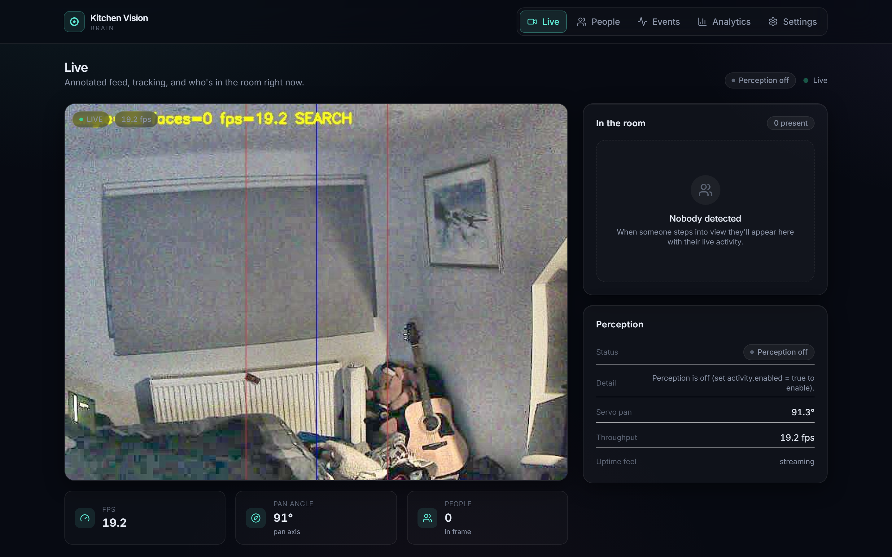
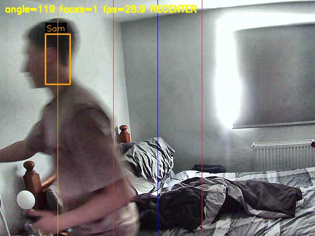
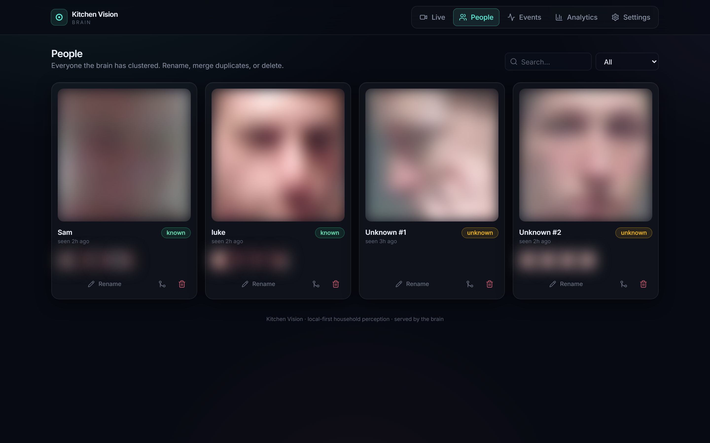
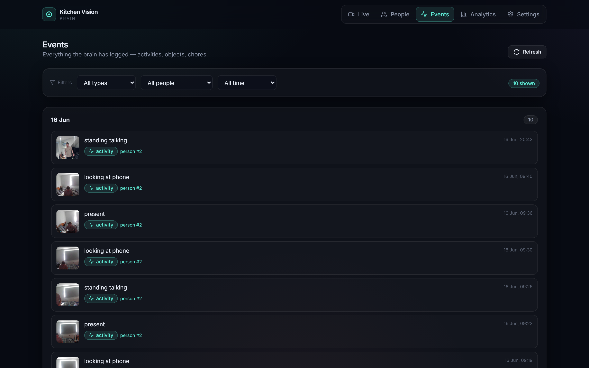
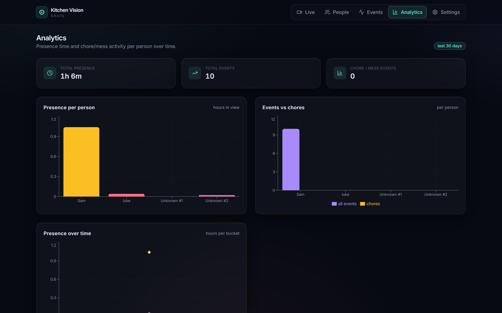

<div align="center">

# 🎥 Kitchen Vision

### A real-time pan-tracking camera that *follows people, recognises who they are, and understands what they do*

A Raspberry Pi pans a camera to keep people framed while a GPU "brain" on a laptop runs
**face recognition**, **multi-person tracking**, and a **vision-LLM activity log** — all streamed to a
polished local dashboard.

<br/>


<br/>



<sub>The live dashboard — annotated camera feed, who's in the room, and real-time servo / FPS telemetry.</sub>

</div>

---

## What it does

Point the camera at a room and Kitchen Vision will:

- **🎯 Track** — detect people every frame and pan a servo to keep the group framed. Motion is smooth
  and the video never stutters, because tracking runs on a fast loop **decoupled** from the slow ML.
- **🧑‍🤝‍🧑 Recognise** — identify household members with GPU face recognition, auto-cluster strangers, and
  let you name / merge / delete identities. Recognition *improves as the hardware allows* (cheap webcam
  today, 12 MP later — no rewrite).
- **🧠 Understand** — caption per-person activity and chore/object events with a **local** vision-LLM
  ("standing talking", "looking at phone", "left a plate on the table") onto a searchable timeline + analytics.

It is **local-first and privacy-first**: biometric data never leaves the machine, the cloud model is
opt-in, "delete a person" erases everything about them, and no continuous video is recorded.

## Demo

| Live tracking + recognition | People (auto-clustered identities) |
|---|---|
|  |  |
| *Real on-camera capture: face recognised as **“Sam”**, box locked, servo re-centring at ~29 fps.* | *Identities the brain clustered itself — rename, merge, or delete. (Faces blurred for privacy.)* |

| Activity timeline | Analytics |
|---|---|
|  |  |
| *Per-person events logged by the vision-LLM.* | *Presence time and event/chore breakdowns (Recharts).* |

## How it works

Kitchen Vision is split across two machines so each does only what it's best at — an **edge/brain
architecture** with a clean, decoupled wire protocol.

```
   Raspberry Pi 3 — "HEAD"                         Windows laptop — "BRAIN"  (RTX 4050)
   ┌────────────────────────────┐                  ┌────────────────────────────────────────────┐
   │ USB webcam capture          │   MJPEG  :8000   │ ingest      pull feed, tag w/ servo angle    │
   │ pan servo (HW-PWM + slew)   │ ───────────────► │ recognition InsightFace on CUDA + fusion     │
   │ MJPEG server  /raw  /stream │                  │ tracking    group-frame → servo angle        │
   │ UDP in :9999 angle :9998 ov │ ◄─────────────── │ perception  vision-LLM → structured events   │
   └────────────────────────────┘   UDP angle       │ store       SQLite (WAL) + crops + thumbs     │
                                     + overlay        │ api/web     FastAPI + React SPA dashboard     │
                                                      └────────────────────────────────────────────┘
```

- **Head (Pi):** does only what must sit next to the camera — capture + servo. Hardware-PWM keeps the
  servo silicon-timed and jitter-free; a 100 Hz slew thread eases each move for smooth glides.
- **Brain (laptop):** all ML, storage, API and UI. Because the control loop stays local-ish, **tracking
  survives a flaky network** — the brain can drop offline and the head still pans.

> Full design in **[docs/ARCHITECTURE.md](docs/ARCHITECTURE.md)**; the authoritative cross-module
> contract is **[docs/INTERFACES.md](docs/INTERFACES.md)**.

## Engineering highlights

- **Real-time decoupling.** The servo loop was stalling for ~2 s every time GPU recognition ran. I split
  capture/track (a fast YuNet loop driving the servo every frame) from recognition (GPU-paced, latest-wins)
  and a zero-staleness frame grabber — tracking went from a 2 s freeze to a steady **~24–30 fps**.
- **Interface-driven & extensible.** Capture, face engine, perception source, vision-LLM and servo
  transport are each an interface with a default impl. A 12 MP CSI camera, a tilt axis, or a local-CV
  object tracker drop in **without touching the rest of the system** (the servo angle is already an N-axis vector).
- **GPU recognition that holds up on a cheap sensor.** InsightFace (`buffalo_l`) on CUDA, with
  quality-gated clustering, multi-template identity matching, and best-shot multi-frame fusion to stop one
  person fragmenting into many "Unknown #N".
- **Concurrency done carefully.** Decoupled daemon threads (capture/track · recognition · perception ·
  prune · uvicorn) share one lock-guarded state singleton; SQLite is WAL with per-thread connections.
- **Full stack, one repo:** embedded Python on the Pi → GPU ML → FastAPI → a React/TypeScript SPA →
  SQLite, with a **96-test** pytest suite and an offline `--selfcheck` wiring gate.

## Tech stack

| Layer | Tech |
|---|---|
| **Head (edge)** | Python 3.13, OpenCV / V4L2, sysfs hardware-PWM servo, stdlib HTTP + UDP |
| **Brain (ML)** | onnxruntime-**CUDA**, InsightFace, OpenCV, NumPy |
| **Perception** | local vision-LLM (Qwen2-VL) via transformers; OpenAI-compatible cloud fallback |
| **API / store** | FastAPI · uvicorn · WebSocket/SSE · SQLite (WAL) |
| **Web** | Vite · React · TypeScript · Tailwind · Recharts (built static, served by the API) |

## Getting started

You need two machines on the same Wi-Fi LAN: a **Raspberry Pi** with a camera + pan servo (the *head*),
and a **laptop/PC with an NVIDIA GPU** (the *brain*).

### 1. Head — on the Raspberry Pi

The Pi runs [`head/agent.py`](head/agent.py): it serves the camera as MJPEG on `:8000` and pans the
servo from UDP commands. It's installed as a `systemd` service so it autostarts on boot.

```bash
# one-time: enable hardware PWM on GPIO18, then reboot
echo 'dtoverlay=pwm,pin=18,func=2' | sudo tee -a /boot/firmware/config.txt

# install + run the service (see head/kitchen-vision.service)
sudo cp head/kitchen-vision.service /etc/systemd/system/
sudo systemctl enable --now kitchen-vision

# verify it's up
systemctl status kitchen-vision        # active (running)
hostname -I                            # note the Pi's LAN IP for the brain config
```

It now serves MJPEG at `http://<pi-ip>:8000/raw` and listens on UDP `:9999` (target angle) + `:9998` (overlay).

### 2. Brain — on the laptop (NVIDIA GPU)

```bash
cd brain
cp config.example.json config.json     # then set "pi_ip" to your Pi's LAN IP

python -m venv .venv && .venv/Scripts/activate     # Windows; use source .venv/bin/activate on Linux
pip install -r requirements.txt                    # core ML + API  (see requirements-vlm.txt for the local VLM)

python -m kitchenvision --selfcheck    # offline wiring check → prints "selfcheck ok"
python -m kitchenvision                # → open the dashboard at http://localhost:8090
```

> 💡 First run downloads InsightFace `buffalo_l` (~300 MB) once. Set `servo_enabled: false` in
> `config.json` to run the full pipeline **without moving the camera** (tracker still computes angles).

### Run the brain in Docker (alternative)

```bash
cd brain && docker compose up -d --build      # GPU brain in a container; dashboard on :8090
```

See **[brain/DOCKER.md](brain/DOCKER.md)** for the NVIDIA-runtime details.

### Dashboard dev server (optional)

```bash
cd brain/web && npm install && npm run dev    # Vite dev server, proxies /api,/video,/events → :8090
```

## Project structure

```
.
├── head/        Raspberry Pi agent — capture + hardware-PWM pan servo + MJPEG/UDP
├── brain/       Laptop "brain": all ML, API, storage, dashboard
│   ├── kitchenvision/   capture · recognition · tracking · perception · vlm · store · api · pipeline
│   ├── web/             React + TypeScript + Tailwind SPA (built static, served by the API)
│   ├── tests/           pytest suite (recognition, tracking, perception, API, db…)
│   └── config.example.json · requirements*.txt · Dockerfile
└── docs/        ARCHITECTURE.md · INTERFACES.md · ROADMAP.md
```

## Roadmap

Built phase-by-phase against a frozen interface contract (`docs/INTERFACES.md`):

- **A–E ✅** scaffold & contract → core backend (recognised + tracked feed) → perception + local VLM →
  API + React SPA → webcam optimisation & recognition hardening.
- **F 🚧** end-to-end verification on the live rig + 12 MP-camera readiness.

Designed to scale up without a rewrite: a **12 MP camera** (new `FeedSource`), a **tilt servo**
(second axis), and a **local-CV object tracker** for richer chore/object events are all drop-in upgrades.

---

<div align="center">
<sub>Built by <b>Sam</b> · a from-scratch real-time computer-vision system spanning embedded hardware, GPU ML, and a full-stack web app.</sub>
</div>
